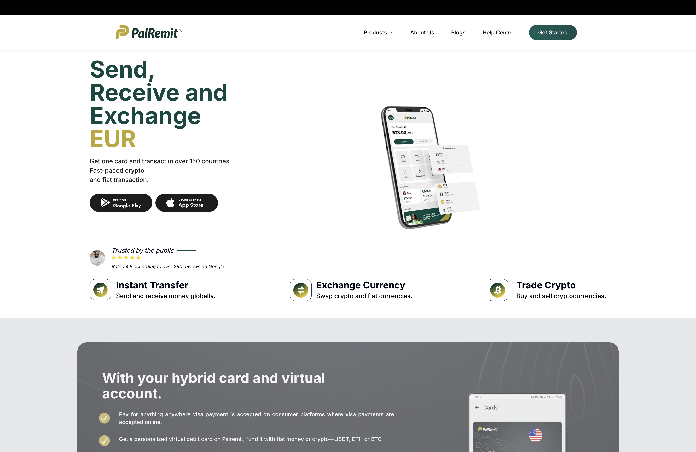

# Tamara Elayelagha - Fullstack Software Engineer Portfolio



A modern, responsive portfolio website showcasing my work as a Fullstack Software Engineer specializing in React, Node.js, Python, and enterprise applications.

## 🚀 Live Demo

[View Portfolio](https://tamara-elayelagha.netlify.app/)

## 🛠️ Tech Stack

### Frontend
- **React 18** - Modern React with hooks and functional components
- **TypeScript** - Type-safe development
- **Tailwind CSS** - Utility-first CSS framework
- **Vite** - Fast build tool and development server
- **Lucide React** - Beautiful icons

### Backend & Fullstack
- **Node.js** - Server-side JavaScript runtime
- **Express.js** - Web application framework
- **Python** - Backend development with Django
- **FastAPI** - Modern Python web framework
- **PostgreSQL** - Relational database
- **MongoDB** - NoSQL database

### DevOps & Tools
- **Git** - Version control
- **ESLint** - Code linting
- **Vite** - Build tooling
- **Netlify** - Deployment platform

## 📁 Project Structure

```
my-portfolio/
├── public/                 # Static assets
│   ├── favicon.svg        # Custom favicon
│   ├── projects/          # Project screenshots
│   └── websites/          # Website mockups
├── src/
│   ├── components/        # React components
│   │   ├── Hero.jsx       # Landing section
│   │   ├── Projects.jsx   # Portfolio showcase
│   │   ├── Experience.jsx # Work experience
│   │   ├── Skills.jsx     # Technical skills
│   │   └── ...
│   ├── data/              # Static data
│   │   └── projects.json  # Project information
│   ├── App.jsx            # Main app component
│   └── main.jsx           # React entry point
├── index.html             # HTML template
├── package.json           # Dependencies
├── vite.config.js         # Build configuration
└── README.md              # This file
```

## 🎯 Featured Projects

### 🔹 Linguaspan - AI Transcription Platform
- **Tech**: FastAPI, React, TypeScript, Hugging Face
- **Features**: Real-time transcription for African languages
- **Live**: [linguaspanapp.com](https://www.linguaspanapp.com/)

### 🔹 MoneSave/Orukka - Mobile Savings App
- **Tech**: Flutterflow, UI/UX Design
- **Features**: 60% onboarding optimization, revenue growth
- **Platforms**: [App Store](https://apps.apple.com/ng/app/orukka-by-monesave-ring-app/id6480351864), [Play Store](https://play.google.com/store/apps/details?id=com.mycompany.monesave)

### 🔹 Palremit Dashboard - Fintech Operations
- **Tech**: React, TypeScript, Fintech APIs
- **Features**: 7 user roles, crypto/fiat transactions
- **Scale**: Enterprise-level financial operations

### 🔹 HRIS Management System
- **Tech**: Next.js, TypeScript, React Query
- **Features**: 8 modules, 90% stability improvement
- **Migration**: JavaScript to TypeScript modernization

## 🚀 Getting Started

### Prerequisites
- Node.js (v16 or higher)
- npm or yarn

### Installation

1. **Clone the repository**
   ```bash
   git clone https://github.com/yourusername/portfolio.git
   cd portfolio
   ```

2. **Install dependencies**
   ```bash
   npm install
   ```

3. **Start development server**
   ```bash
   npm run dev
   ```

4. **Build for production**
   ```bash
   npm run build
   ```

## 📊 Key Achievements

- **600%** increase in HR department productivity (Paytime)
- **90%** improvement in system stability (HRIS migration)
- **40%** SEO improvement and 50% reduction in support tickets
- **80%** improvement in user satisfaction (SCM prototype)
- **Revenue growth** through UI/UX optimization (MoneSave)

## 📞 Contact

- **Email**: tamara.elayelagha@email.com
- **LinkedIn**: [Tamara Elayelagha](https://linkedin.com/in/tamara-elayelagha)
- **GitHub**: [tamara-elayelagha](https://github.com/tamara-elayelagha)
- **Portfolio**: [tamara-elayelagha.netlify.app](https://tamara-elayelagha.netlify.app/)

## 📝 License

This project is open source and available under the [MIT License](LICENSE).

---

**Built with ❤️ by Tamara Elayelagha**